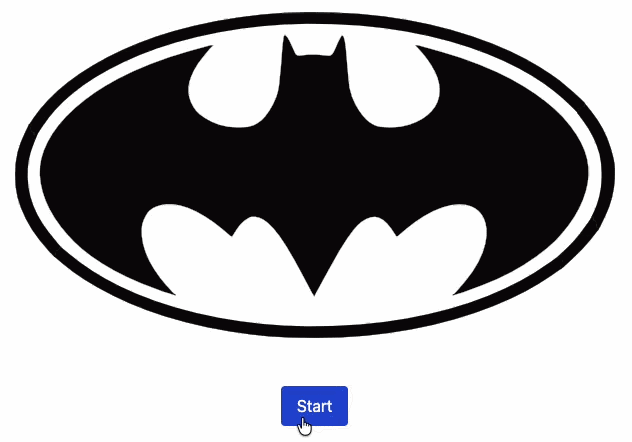

## What is LoadGo?



**LoadGo** is a Javascript plugin that allows you to create a progress bar using your own images.

- Perfect for logo animation when user is waiting for something to be loaded (a website, retrieving information, updating status, etc.)

- It creates an overlay above your `img` element and simulates a loading process using dimension changes.

- Tested up in IE 9, IE 10, IE Edge, Google Chrome and Mozilla Firefox.

## LoadGo for Wordpress

**LoadGo** is also available for Wordpress as a plugin called **LoadGo for WP**. This plugin uses PACE to track your page loading progress, and uses LoadGo to display a logo with this progress.

- Official Wordpress link: [https://wordpress.org/plugins/loadgo-for-wp/](https://wordpress.org/plugins/loadgo-for-wp/)

- Github: [https://github.com/franverona/LoadGo-for-WP](https://github.com/franverona/LoadGo-for-WP)

## Breaking changes

Since **2.2** version, **LoadGo** now wraps the image on a `div` element, then add the overlay as the first sibling of the image following this template:

```
<div class="loadgo-container">
  <image src="logo.png" class="..." style="..." />
  <div class="loadgo-overlay" style="..." />
</div>
```

This change makes easy for the plugin to calculate overlay's dimension and position. Make sure that your CSS rules like `div > img` are applied correctly.

For example, if you have html and CSS like these:

```
<style>
  .image-container > img {
      margin: 0 auto;
  }
</style>

<div class="image-container">
  
</div>
```

You should change it to this:

```
<style>
  div > div > img {
      margin: 0 auto;
  }
</style>

<div class="image-container">
  
</div>
```

Or even better, assign a CSS class and forget about `>`:

```
<style>
  .my-image {
      margin: 0 auto;
  }
</style>

<div class="image-container">
  
</div>
```

## Changelog

**2.2.1** - Latest release (16-04-2017)

* Code style
* Javascript: setProgress method now checks if element exists.
* Added Gruntfile.
* Fixed Javascript examples.

**2.2** - (23-06-2017)

* Added a new method: `destroy`.
* Added tests (more will be added in the future).
* Fix several bugs.
* LoadGo default template changed.
* Improved documentation.
* Javascript version improved.
* jQuery version improved.

**2.1** - (12-04-2016)

*  Fix bug with LoadGo jQuery version where 'left to right' direction was not working.
*  Added some examples.

**2.0** (02-04-2016)
*  **Pure Javascript version release**: now you can use LoadGo plugin without jQuery.
*  Fix overlay reposition bug when resizing window.

**1.0.1** (02-11-2015)
*  Fix for 'undefined' errors with newer jQuery versions.

**1.0** (15-10-2015)
*  First release.

## Tests

Tests can be find under `test/jquery` folder for jQuery version tests, and `test/javascript` for pure Javascript version tests. Just open their `index.html` file in your browser and all tests should be executed sucessfully.

Tests are done using [Mocha](https://mochajs.org/).

## How to use LoadGo

- If you are using [jQuery](http://jquery.com/download/), you have to include it **BEFORE** LoadGo. It works with `jQuery >= 1.11.2`.

- If you are not using jQuery, just include **LoadGo** pure Javascript version and start using it.

### Production environment (CDN)

**(17-Oct-2015)** **LoadGo** is now hosted on [cdnjs](https://cdnjs.com/libraries/LoadGo), so you can link it directly. Thanks so much to cdnjs team for their quickly response! ([issue#5927](https://github.com/cdnjs/cdnjs/issues/5927))
```
<!-- If you use jQuery -->
<script type="text/javascript" src="https://cdnjs.cloudflare.com/ajax/libs/LoadGo/2.2.1/loadgo.min.js"></script>

<!-- If you don't use jQuery -->
<script type="text/javascript" src="https://cdnjs.cloudflare.com/ajax/libs/LoadGo/2.2.1/loadgo-nojquery.min.js"></script>
```
### Development environment

1. Download LoadGo from [this link](https://github.com/franverona/loadgo/archive/master.zip) or [clone it from GitHub](https://github.com/franverona/loadgo)

2. Uncompress it (if zipped) and copy **LoadGo** folder into your JS scripts.

3. Insert the following code in your webpage:
```
<!-- If you use jQuery -->
<script type="text/javascript" src="loadgo/loadgo.js"></script>

<!-- If you don't use jQuery -->
<script type="text/javascript" src="loadgo/loadgo-nojquery.js"></script>
```
You can also use the [minified](http://en.wikipedia.org/wiki/Minification_(programming)) version:
```
<!-- If you use jQuery -->
<script type="text/javascript" src="loadgo/loadgo.min.js"></script>

<!-- If you don't use jQuery -->
<script type="text/javascript" src="loadgo/loadgo-nojquery.min.js"></script>
```

**LoadGo** needs fully loaded images in order to read its dimensions properly. If you are not sure when this is going to happen, you can use this piece of code with each image:
```
// jQuery
$("#my-image").load(function() {
    $('#my-image').loadgo();
}).each(function() {
    if(this.complete) $(this).load();
});

// Javascript
var image = document.getElementById("my-image");
image.onload = function () {
    Loadgo.init(this);
};
```
## Examples

You can check for examples on: 

- [LoadGo Official Site](http://franverona.com/loadgo/)
- **/examples** folder.

## Documentation

### Introduction

**LoadGo** is a plugin which provides you a better way to keep your users updated about a loading process. Some uses cases may be:

*  User uploads a file to your server.
*  System is converting a file to PDF.
*  Current page is loading.

To do this, **LoadGo** wraps your image into a `div`, and add an overlay inside this wrapper. Then, it will change overlay's dimensions when setting a progress to simulate a loading behaviour.

This plugin **does not** control asynchronous behaviour for your loading process, so you have to do that by yourself in your app.

**LoadGo** will work only on `img` elements given by `id`. For example, this will work:

```
// HTML
<div>
    
</div>

// jQuery
$('#logo').loadgo();

// Javascript
Loadgo.init(document.getElementById('logo'));
```
But this **will not work**:

```
// HTML
<div>
    
</div>
<div>
    
</div>

// jQuery
$('.logo').loadgo();

// Javascript
Loadgo.init(document.getElementByClass('logo'));
```

### Initialization

**LoadGo** needs to be initialized in a `img` element before use.
```
// jQuery
$('#logo').loadgo();

// javascript
Loadgo.init(document.getElementById('logo'));
```
Now, you are capable of set and simulate a progress. **LoadGo** have methods and a couple of options which will help you.

**LoadGo** also applies an empty CSS class to the overlay called `loadgo-overlay` in case that you want to implement your own resize function or some other advanced features.

## Options

| Name | Type | Default  | Description |
| --- | --- | --- | --- |
| `bgcolor` | `String` | `#FFFFFF` | Background color for the overlay in hexadecimal or RGB. |
| `opacity` | `Number` | `0.5` | Overlay transparency. |
| `animated` | `Boolean` | `true` | `true` if CSS animations are enable when using `setprogress`, false otherwise. Have in mind that Internet Explorer does not support CSS transitions. |
| `image` | `String` | `null` | Image url to be used if you want a background image instead of a simple color. This option disables `bgcolor` option. |
| `class` | `String` | `null` | CSS class which will be applied to the overlay. Make sure that all looks good because some CSS options could invalidate other **LoadGo** plugin CSS options. |
| `resize` | `Function` | Custom | **LoadGo** provides a function which automatically resizes its overlay by default, but you can use your own. |
| `direction` | `String` | `lr` | Animation direction. Possible values: `lr` (left to right), `rl` (right to left), `bt` (bottom to top), `tb` (top to bottom). |
| `filter` | `String` | null | CSS image filter according to [CSS filter property](https://developer.mozilla.org/en-US/docs/Web/CSS/filter). Possible values: `blur`, `grayscale`, `sepia`, `hue-rotate`, `invert`, ```opacity```. |

## Methods

### Get / Set options
### `$element.loadgo('options', <options>)` | `Loadgo.options(<element>, <options>)`

Get/Set plugin options. When setting options, the parameter must be a JSON object. This is specially useful if element is already initiate, and you want to change properties dynamically based on your app's logic.

```
// jQuery - Get current options
$('#logo').loadgo('options');

// Javascript - Get current options
Loadgo.options(document.getElementById('logo'));

// jQuery - Set options
$('#logo').loadgo('options', { direction: 'bt' });

// Javascript - Set options
Loadgo.options(document.getElementById('logo'), { direction: 'bt' });
```

### Set progress
### `$element.loadgo('setprogress', <number>)` | `Loadgo.options(<element>, <number>)`

Set progress number to loading overlay. This number must be between `0` and `100`.

```
// jQuery
$('#logo').loadgo('setprogress', 50);

// Javascript
Loadgo.setprogress(document.getElementById('logo'), 50);
```

### Reset progress
### `$element.loadgo('resetprogress')` | `Loadgo.resetprogress(<element>)`

Reset current progress. This is really useful when you are using the same element for multiple loads, and you need to reset all before starting a new one.

```
// jQuery
$('#logo').loadgo('resetprogress');

// Javascript
Loadgo.resetprogress(document.getElementById('logo'));
```

### Get progress
### `$element.loadgo('getprogress')` | `Loadgo.getprogress(<element>)`

Get current progress. This number will be between `0` and `100`.

```
// jQuery
$('#logo').loadgo('getprogress');

// Javascript
Loadgo.getprogress(document.getElementById('logo'));
```

### Start loop
### `$element.loadgo('loop', <number>)` | `Loadgo.loop(<element>, <number>)`

Sets overlay to loop indefinitely until stopped. This is useful for situations where you have no way of measuring the progress. This method accepts a duration (ms) parameter to customize animation speed.

```
// jQuery
$('#logo').loadgo('loop', 10);

// Javascript
Loadgo.loop(document.getElementById('logo'), 10);
```

### Stop loop
### `$element.loadgo('stop')` | `Loadgo.stop(<element>)`

Stops the loop previously initiated with `loop` method and shows the full image. Since loops are indefinite we need to use this method to manually stop it.

```
// jQuery
$('#logo').loadgo('stop');

// Javascript
Loadgo.stop(document.getElementById('logo'));
```

### Destroy
### `$element.loadgo('destroy')` | `Loadgo.destroy(<element>)`

Removes all plugin properties and restore everything. This method will also removes `div` elements created (`loadgo-container` and `loadgo-overlay`), so make sure that you are not using them for anything else before calling `destroy`.

```
// jQuery
$('#logo').loadgo('destroy');

// Javascript
Loadgo.destroy(document.getElementById('logo'));
```

## Real example

In your webpage, you are using a jQuery plugin like [Uploadify](http://www.uploadify.com/) to give your users a way to upload files to you page (for example: update his/her web avatar). Most of these plugins provide events like `onUploadStart`, `onUploadProgress` or `onUploadComplete`. These events have variables which give you a lot of information about your current load progress (file size, current uploaded bytes, etc).

You can use this information with **LoadGo** to update logo overlay like this:
```
// Set LoadGo on your Logo
$('#logo').loadgo();

// Set Uploadify on your upload input
$('#uploadinput').uploadify({
  // init options...
  onUploadStart: function (event) {
    // Upload is going to start, so we need to reset loadgo
    $('#logo').loadgo('resetprogress');
  },
  onUploadProgress: function (event) {
    // We receive some bytes on our upload and update loadgo progress,
    // but first, we should calculate total uploaded percentage
    var p = event.bytesLoaded / event.bytesTotal;
    $('#logo').loadgo('setprogress', p);
  },
  onUploadComplete: function (event) {
    // Upload complete
  }
});
```
**LoadGo** is under MIT License. Feel free to download, modify and adapt it to your own purposes. If you find any bug, send a pull request or write an issue.

## Credits

Say hello! :)

**Fran Verona**
* [http://franverona.com](http://franverona.com)
* [@franverona](https://twitter.com/franverona)
