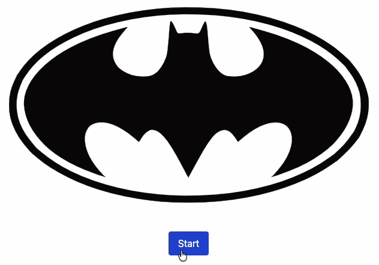

# LoadGo



**LoadGo** is a JavaScript plugin that creates a progress bar overlay using your own images.

- Perfect for logo animation while users wait for a website to load, a file to upload, a status to update, etc.
- Creates an overlay above your `img` element and simulates loading progress using dimension changes.
- Available as a jQuery plugin and a standalone pure JavaScript version.
- Tested in modern browsers (Chrome, Firefox, Safari, Edge).

## Table of contents

- [Installation](#installation)
- [TypeScript](#typescript)
- [Quick Start](#quick-start)
- [Documentation](#documentation)
  - [How it works](#how-it-works)
  - [Image load timing](#image-load-timing)
  - [Initialization](#initialization)
  - [Options](#options)
  - [onProgress callback](#onprogress-callback)
  - [onThreshold callback](#onthreshold-callback)
  - [Custom animation timing](#custom-animation-timing)
  - [Accessibility](#accessibility)
  - [Methods](#methods)
  - [Custom events](#custom-events)
  - [Pause and resume a loop](#pause-and-resume-a-loop)
- [Real-world example](#real-world-example)
- [Examples](#examples)
- [Tests](#tests)
- [Breaking changes in 2.2](#breaking-changes-in-22)
- [Changelog](#changelog)
- [License](#license)
- [Credits](#credits)

## Installation

### npm (recommended)

```bash
npm install loadgo
```

**Vanilla JS:**
```js
import 'loadgo'
// window.Loadgo is now available
```

**jQuery plugin** (bring your own jQuery 4+):
```js
import 'loadgo/jquery'
// $.fn.loadgo is now available
```

### Manual

1. [Download](https://github.com/franverona/loadgo/archive/master.zip) or [clone](https://github.com/franverona/loadgo) the repository.
2. Include the script in your page:

```html
<!-- jQuery version (requires jQuery 4+) -->
<script src="path/to/loadgo.js"></script>

<!-- Pure JavaScript version (no jQuery) -->
<script src="path/to/loadgo-vanilla.js"></script>
```

You can also use the minified versions from the `dist/` folder (`dist/loadgo.min.js` / `dist/loadgo-vanilla.min.js`).

## TypeScript

Type declarations are included in the package — no `@types/*` install needed.

**Vanilla JS** — `Loadgo` is available as both a named export and a global:

```ts
import type { LoadgoOptions } from 'loadgo'

const options: LoadgoOptions = { direction: 'bt', opacity: 0.8 }
Loadgo.init(document.getElementById('logo') as HTMLImageElement, options)
```

**jQuery plugin** — importing `loadgo/jquery` augments the global `JQuery` interface automatically:

```ts
import 'loadgo/jquery'

$('#logo').loadgo({ direction: 'bt' })
$('#logo').loadgo('setprogress', 50)

const progress: number = $('#logo').loadgo('getprogress')
```

> The jQuery types require `@types/jquery` to be installed in your project.

## Quick Start

```html

```

```js
// jQuery
$('#logo').loadgo();
$('#logo').loadgo('setprogress', 50);

// Pure JavaScript
Loadgo.init(document.getElementById('logo'));
Loadgo.setprogress(document.getElementById('logo'), 50);
```

## Documentation

### How it works

LoadGo wraps your `img` element in a `div` and adds an overlay inside that wrapper. Setting a progress value changes the overlay's dimensions to simulate a loading state.

This plugin does **not** manage async operations — you connect it to your own upload/load/progress events.

LoadGo only works on `img` elements. Use `Loadgo.init` for a single element, or `Loadgo.initAll` to initialise multiple elements in one call (vanilla JS only — the jQuery plugin already iterates over matched sets implicitly).

### Image load timing

LoadGo needs fully loaded images to read their dimensions correctly. Use the following pattern if the image may not be loaded yet:

```js
// jQuery
$('#logo')
  .on('load', () => {
    $('#logo').loadgo()
  })
  .each((_, el) => {
    if (el.complete) $(el).trigger('load')
  })

// Pure JavaScript
const image = document.getElementById('logo')
image.onload = () => {
  Loadgo.init(image)
}
```

### Initialization

```js
// jQuery
$('#logo').loadgo();

// Pure JavaScript — single element
Loadgo.init(document.getElementById('logo'));

// Pure JavaScript — multiple elements at once
Loadgo.initAll('.product-image', { bgcolor: '#000', opacity: 0.4 })
Loadgo.initAll(document.querySelectorAll('img.loadable'), options)
```

`initAll` accepts a CSS selector string or a `NodeList`/`HTMLCollection` and calls `init` on each matched ``. Non-`` elements in the set are silently skipped. It returns an array of the initialized DOM elements so you can keep references for later calls:

```js
const images = Loadgo.initAll('.loadable', { direction: 'bt' })

// Later…
images.forEach(el => Loadgo.setprogress(el, 50))
images.forEach(el => Loadgo.destroy(el))
```

### Options

| Name | Type | Default | Description |
| --- | --- | --- | --- |
| `bgcolor` | `String` | `#FFFFFF` | Overlay background color (hex or RGB). Disabled when `image` is set. |
| `opacity` | `Number` | `0.5` | Overlay transparency. |
| `animated` | `Boolean` | `true` | Enable CSS transitions on `setprogress`. |
| `animationDuration` | `Number` | `0.6` | CSS transition duration in seconds. Only applies when `animated` is `true`. |
| `animationEasing` | `String` | `ease` | CSS transition easing function (any valid CSS `transition-timing-function`). Only applies when `animated` is `true`. |
| `direction` | `String` | `lr` | Animation direction: `lr` (left→right), `rl` (right→left), `bt` (bottom→top), `tb` (top→bottom). |
| `image` | `String` | `null` | URL for a background image on the overlay instead of a solid color. |
| `class` | `String` | `null` | CSS class applied to the overlay. |
| `filter` | `String` | `null` | CSS image filter applied directly to the `img`. Values: `blur`, `grayscale`, `sepia`, `hue-rotate`, `invert`, `opacity`. No overlay is created when this is set. |
| `resize` | `Function` | built-in | Custom window resize handler. When provided, replaces the built-in one entirely. |
| `onProgress` | `Function` | `null` | Callback invoked after every `setprogress` call, receiving the current progress value (0–100). |
| `onThreshold` | `Object` | `null` | Map of progress values (0–100) to callbacks. Each callback fires once when progress first reaches or crosses its key. Thresholds reset when `resetprogress()` is called. |
| `ariaLabel` | `String` | `Loading` | Text for the `aria-label` attribute on the progressbar element. |
| `autoStop` | `Boolean` | `false` | Automatically calls `stop()` when `setprogress(100)` is reached outside of a loop. Fires `loadgo:complete` then `loadgo:stop`. Has no effect while a loop is running. |

### onProgress callback

Use `onProgress` to react every time the progress value changes — for example to update a separate counter:

```js
// jQuery
$('#logo').loadgo({
  onProgress: (progress) => {
    document.getElementById('counter').textContent = `${progress}%`
  },
})

// Pure JavaScript
Loadgo.init(document.getElementById('logo'), {
  onProgress: (progress) => {
    document.getElementById('counter').textContent = `${progress}%`
  },
})
```

### onThreshold callback

Use `onThreshold` to fire callbacks once when progress crosses specific values — useful for multi-stage loading UIs. Each callback fires at most once per pass; calling `resetprogress()` resets all thresholds so they can fire again.

```js
// jQuery
$('#logo').loadgo({
  onThreshold: {
    50: () => console.log('halfway there'),
    100: () => document.getElementById('status').textContent = 'Done!',
  },
})

// Pure JavaScript
Loadgo.init(document.getElementById('logo'), {
  onThreshold: {
    50: () => console.log('halfway there'),
    100: () => document.getElementById('status').textContent = 'Done!',
  },
})
```

### Custom animation timing

```js
// Slow, linear transition
$('#logo').loadgo({ animationDuration: 1.5, animationEasing: 'linear' })

// Snappy, with a bounce effect
Loadgo.init(document.getElementById('logo'), {
  animationDuration: 0.3,
  animationEasing: 'cubic-bezier(0.34, 1.56, 0.64, 1)',
})
```

### Accessibility

LoadGo automatically adds `role="progressbar"`, `aria-valuemin`, `aria-valuemax`, and `aria-valuenow` to the overlay element (or to the `img` itself when `filter` mode is used). The `aria-valuenow` attribute is kept in sync with the current progress value on every `setprogress` call.

Use `ariaLabel` to provide a meaningful label for screen readers:

```js
$('#logo').loadgo({ ariaLabel: 'File upload progress' })

Loadgo.init(document.getElementById('logo'), { ariaLabel: 'File upload progress' })
```

### Methods

#### Get / Set options
**`$element.loadgo('options', <options>)`** | **`Loadgo.options(<element>, <options>)`**

Get or set plugin options on an already-initialized element.

```js
// jQuery
$('#logo').loadgo('options');                      // get
$('#logo').loadgo('options', { direction: 'bt' }); // set

// Pure JavaScript
Loadgo.options(document.getElementById('logo'));                      // get
Loadgo.options(document.getElementById('logo'), { direction: 'bt' }); // set
```

---

#### Set progress
**`$element.loadgo('setprogress', <number>)`** | **`Loadgo.setprogress(<element>, <number>)`**

Set the progress value (0–100).

```js
// jQuery
$('#logo').loadgo('setprogress', 50);

// Pure JavaScript
Loadgo.setprogress(document.getElementById('logo'), 50);
```

---

#### Get progress
**`$element.loadgo('getprogress')`** | **`Loadgo.getprogress(<element>)`**

Returns the current progress value (0–100).

```js
// jQuery
$('#logo').loadgo('getprogress');

// Pure JavaScript
Loadgo.getprogress(document.getElementById('logo'));
```

---

#### Reset progress
**`$element.loadgo('resetprogress')`** | **`Loadgo.resetprogress(<element>)`**

Resets progress to 0. Useful when reusing the same element for multiple loading operations.

```js
// jQuery
$('#logo').loadgo('resetprogress');

// Pure JavaScript
Loadgo.resetprogress(document.getElementById('logo'));
```

---

#### Start loop
**`$element.loadgo('loop', <duration>)`** | **`Loadgo.loop(<element>, <duration>)`**

Loops the overlay animation indefinitely — useful when the total progress is unknown. `duration` is in milliseconds.

```js
// jQuery
$('#logo').loadgo('loop', 10);

// Pure JavaScript
Loadgo.loop(document.getElementById('logo'), 10);
```

---

#### Stop loop
**`$element.loadgo('stop')`** | **`Loadgo.stop(<element>)`**

Stops a running loop and reveals the full image.

```js
// jQuery
$('#logo').loadgo('stop');

// Pure JavaScript
Loadgo.stop(document.getElementById('logo'));
```

---

#### Pause loop
**`$element.loadgo('pause')`** | **`Loadgo.pause(<element>)`**

Pauses a running loop, freezing the animation at the current progress. The direction toggle state is also preserved so `resume()` continues smoothly in the same direction. No-op if the element is not currently looping.

```js
// jQuery
$('#logo').loadgo('pause');

// Pure JavaScript
Loadgo.pause(document.getElementById('logo'));
```

---

#### Resume loop
**`$element.loadgo('resume')`** | **`Loadgo.resume(<element>)`**

Resumes a paused loop from the exact point where `pause()` was called. No-op if the element is not paused.

```js
// jQuery
$('#logo').loadgo('resume');

// Pure JavaScript
Loadgo.resume(document.getElementById('logo'));
```

---

#### Destroy
**`$element.loadgo('destroy')`** | **`Loadgo.destroy(<element>)`**

Removes the plugin entirely, including the `loadgo-container` and `loadgo-overlay` elements, and restores the original DOM.

```js
// jQuery
$('#logo').loadgo('destroy');

// Pure JavaScript
Loadgo.destroy(document.getElementById('logo'));
```

---

### Custom events

LoadGo dispatches native DOM [`CustomEvent`](https://developer.mozilla.org/en-US/docs/Web/API/CustomEvent)s at key lifecycle points. All events bubble, so you can listen on a parent element if needed.

Events work with both `addEventListener` and jQuery's `.on()`:

```js
// Pure JavaScript
document.getElementById('logo').addEventListener('loadgo:complete', () => {
  console.log('Loading complete!')
})

// jQuery
$('#logo').on('loadgo:complete', () => {
  console.log('Loading complete!')
})
```

Access the event payload via `event.detail`:

```js
document.getElementById('logo').addEventListener('loadgo:progress', (e) => {
  console.log(`Progress: ${e.detail.progress}%`)
})

document.getElementById('logo').addEventListener('loadgo:error', (e) => {
  console.warn('LoadGo error:', e.detail.message)
})
```

#### Event reference

| Event | Fires when | `event.detail` |
| --- | --- | --- |
| `loadgo:init` | `init()` completes | — |
| `loadgo:error` | invalid usage (non-`img` element, loop/stop on uninitialized, double loop) | `{ message: string }` |
| `loadgo:options` | `options()` is called as a setter after init | merged `LoadgoOptions` object |
| `loadgo:progress` | `setprogress()` is called | `{ progress: number }` |
| `loadgo:complete` | progress reaches 100 **outside** of a loop | `{ progress: 100 }` |
| `loadgo:reset` | `resetprogress()` is called | `{ progress: 0 }` |
| `loadgo:start` | `loop()` starts | — |
| `loadgo:cycle` | loop completes one full back-and-forth (bounces back to 0) | — |
| `loadgo:pause` | `pause()` is called on a running loop | `{ progress: number }` |
| `loadgo:resume` | `resume()` restarts a paused loop | `{ progress: number }` |
| `loadgo:stop` | `stop()` is called | `{ progress: 100 }` |
| `loadgo:destroy` | `destroy()` completes | — |

> **Note:** `loadgo:progress` is **not** fired by `resetprogress()` or `stop()` — those operations dispatch `loadgo:reset` and `loadgo:stop` respectively. Similarly, `loadgo:complete` is suppressed while a loop is running, even when progress internally reaches 100.

#### TypeScript

Event types are declared in `LoadgoEventMap` and are automatically applied to `HTMLImageElement.addEventListener`:

```ts
const logo = document.getElementById('logo') as HTMLImageElement

logo.addEventListener('loadgo:progress', (e) => {
  // e.detail is typed as { progress: number }
  console.log(e.detail.progress)
})

logo.addEventListener('loadgo:options', (e) => {
  // e.detail is typed as LoadgoOptions
  console.log(e.detail.bgcolor)
})

logo.addEventListener('loadgo:init', (e) => {
  // e.detail is null — events with no payload have CustomEvent<null>
})
```

### Pause and resume a loop

Use `pause()` and `resume()` to freeze and restart a `loop()` animation without resetting progress. A common use case is pausing when the tab is hidden and resuming when the user returns:

```js
// jQuery
document.addEventListener('visibilitychange', () => {
  if (document.hidden) {
    $('#logo').loadgo('pause')
  } else {
    $('#logo').loadgo('resume')
  }
})

// Pure JavaScript
document.addEventListener('visibilitychange', () => {
  const el = document.getElementById('logo')
  if (document.hidden) {
    Loadgo.pause(el)
  } else {
    Loadgo.resume(el)
  }
})
```

`stop()` still works as before — it clears the interval and sets progress to 100, regardless of whether the loop was paused.

---

## Real-world example

Using LoadGo with [Uploadify](http://www.uploadify.com/) to show upload progress on a logo:

```js
$('#logo').loadgo()

$('#uploadinput').uploadify({
  onUploadStart: () => {
    $('#logo').loadgo('resetprogress')
  },
  onUploadProgress: (event) => {
    const p = (event.bytesLoaded / event.bytesTotal) * 100
    $('#logo').loadgo('setprogress', p)
  },
  onUploadComplete: () => {
    // upload done
  },
})
```

## Examples

- `/examples` folder in this repository

## Tests

Tests run from the CLI via [Vitest](https://vitest.dev/) with a jsdom environment — no browser needed.

```bash
npm test           # run once
npm run test:watch # watch mode
```

Test files:
- `packages/core/tests/loadgo-vanilla.test.js` — vanilla JS implementation
- `packages/core/tests/loadgo.test.js` — jQuery implementation

> Note: Tests that depend on real browser layout (overlay pixel dimensions after `setprogress`) are not included — jsdom has no layout engine, so `getBoundingClientRect()` and `clientWidth` return 0. Those behaviours can be verified manually using the `examples/` folder.

## Breaking changes in 2.2

Since version **2.2**, LoadGo wraps the image in a `div` before adding the overlay:

```html
<div class="loadgo-container">
  
  <div class="loadgo-overlay" style="..." />
</div>
```

If you have CSS rules using child selectors like `div > img`, you may need to update them. The safest fix is to add a class directly to the `img` element:

```html

```

```css
.my-image {
  margin: 0 auto;
}
```

## Changelog

See [CHANGELOG.md](CHANGELOG.md).

## License

MIT — feel free to use, modify, and adapt. If you find a bug, open an issue or send a pull request.

## Credits

**Fran Verona** — https://franverona.com
